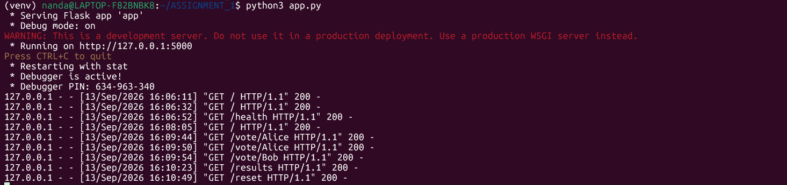
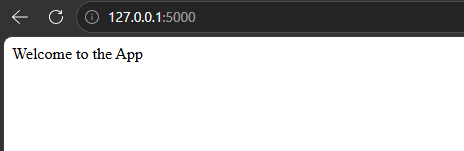
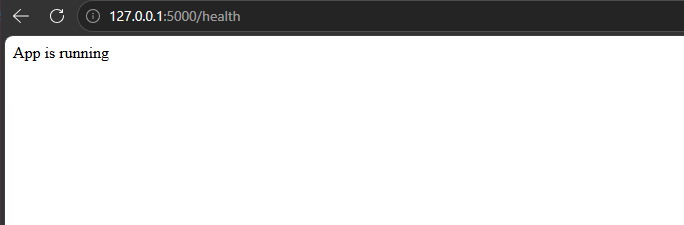
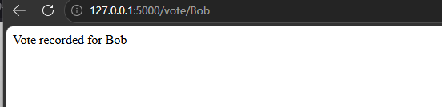
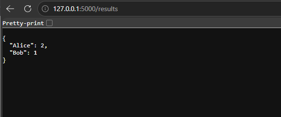
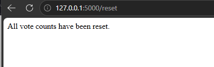
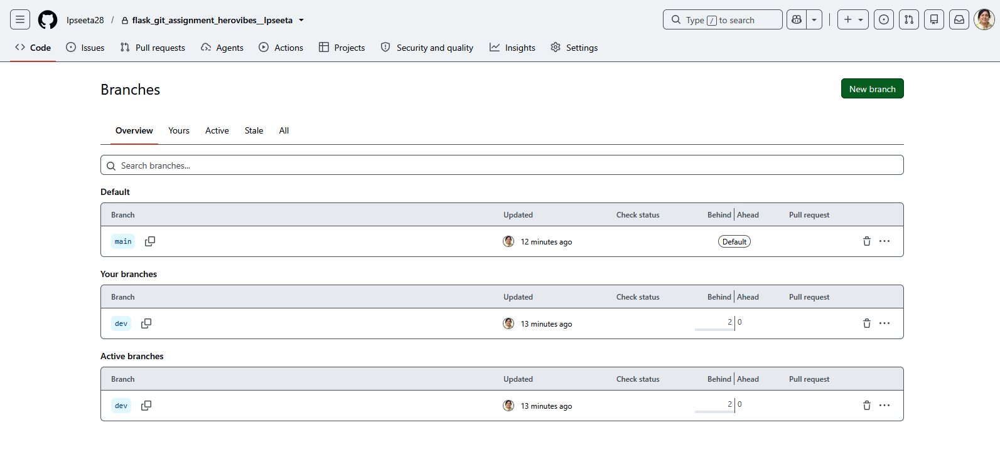
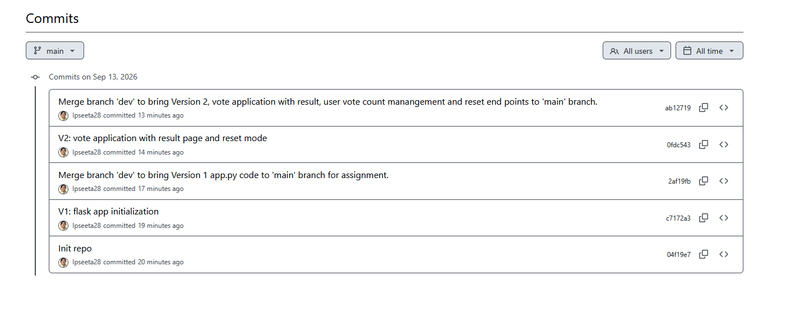
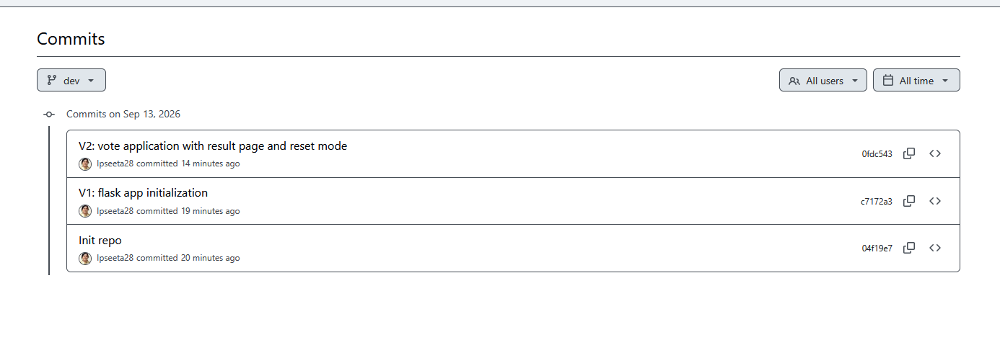

# Flask Voting Application with Git Versioning Workflow

## Project Description

This project is a simple voting application developed using Python and Flask.  
Users can cast votes for candidates by visiting a URL and can view the current voting results.  
The application stores voting information temporarily in memory using a Python dictionary.  
Version 2 extends the application by providing a reset feature to clear all recorded votes.

---

## Technologies Used

- Python 3
- Flask
- Git
- GitHub

---

# Installation and Setup

Follow the steps below to download and run the application on your local machine.

## 1. Clone the Repository

```bash
git clone https://github.com/Ipseeta28/flask_git_assignment_herovibes__Ipseeta.git
```

## 2. Enter the Project Directory

```bash
cd flask_git_assignment_herovibes__Ipseeta
```

## 3. Create a Virtual Environment

```bash
python3 -m venv venv
```

## 4. Activate the Virtual Environment

### Linux/macOS

```bash
source venv/bin/activate
```

### Windows

```bash
venv\Scripts\activate
```

## 5. Install Flask

```bash
pip install flask
```

## 6. Run the Application

```bash
python3 app.py
```

On Windows, you may also use:

```bash
python app.py
```

The Flask development server will start locally.

Open the following address in a browser:

```text
http://127.0.0.1:5000
```

---

# API Endpoint Reference

| Endpoint | Method | Description | Example Response |
|---|---|---|---|
| `/` | GET | Displays the application's welcome message | `Welcome to the App` |
| `/health` | GET | Checks whether the Flask application is running | `App is running` |
| `/vote/<name>` | GET | Records one vote for the candidate specified in the URL | `Vote recorded for Alice` |
| `/results` | GET | Returns the current vote count for all candidates in JSON format | `{"Alice":2,"Bob":1}` |
| `/reset` | GET | Clears all stored vote counts | `All vote counts have been reset.` |

---

# Using the Application

## Home Endpoint

Open:

```text
http://127.0.0.1:5000/
```

Expected response:

```text
Welcome to the App
```

## Health Check

Open:

```text
http://127.0.0.1:5000/health
```

Expected response:

```text
App is running
```

## Cast a Vote

To vote for Alice:

```text
http://127.0.0.1:5000/vote/Alice
```

Expected response:

```text
Vote recorded for Alice
```

Calling the same URL again increases Alice's vote count by one.

Another candidate can be added simply by using a different name:

```text
http://127.0.0.1:5000/vote/Bob
```

## View Voting Results

Open:

```text
http://127.0.0.1:5000/results
```

Example response:

```json
{
  "Alice": 2,
  "Bob": 1
}
```

## Reset Voting Results

Open:

```text
http://127.0.0.1:5000/reset
```

Expected response:

```text
All vote counts have been reset.
```

After resetting, opening `/results` will return an empty JSON object:

```json
{}
```

---

# Data Storage

The application uses a Python dictionary to store candidate names and their vote counts.

```python
votes = {}
```

When a candidate receives their first vote, the candidate is added to the dictionary with a vote count of `1`.

If the candidate already exists, their vote count is increased by one.

The application uses in-memory storage, so the data is not permanently stored. Restarting the Flask server will clear the voting data.

---

# Git Workflow

This project follows a `dev` and `main` branch workflow.

The `dev` branch was used for developing and testing new functionality. Once a version was complete and working correctly, the changes from `dev` were merged into the `main` branch.

The `main` branch therefore represents the stable version of the application.

The workflow used was:

```text
        Development
             |
             v
            dev
             |
      Develop & Test
             |
           Commit
             |
             v
      Merge dev → main
             |
             v
           main
             |
             v
      Stable Release
```

The same workflow was followed for both Version 1 and Version 2.

---

# Version History

| Version | Description |
|---|---|
| **Version 1** | Initial Flask application with the basic application endpoints and voting functionality. |
| **Version 2** | Enhanced the voting application with results management and the `/reset` endpoint for clearing all vote counts. |

## Version 1

Version 1 established the Flask application and the initial working functionality.

It included:

- Flask application initialization
- `/` home endpoint
- `/health` health-check endpoint
- Voting application functionality
- Development performed in the `dev` branch
- Version 1 merged from `dev` into `main`

## Version 2

Version 2 built on Version 1 and completed the voting application functionality.

It included:

- `/vote/<name>` for recording candidate votes
- `/results` for displaying vote counts in JSON format
- `/reset` for clearing all stored votes
- Version 2 development in the `dev` branch
- Version 2 merged from `dev` into `main`

---

# Screenshots

## 1. Flask Application Running

The following screenshot shows the Flask application running successfully.



---

## 2. Home Endpoint

The following screenshot demonstrates the `/` endpoint returning the welcome message.



---

## 3. Health Endpoint

The following screenshot demonstrates the `/health` endpoint.



---

## 4. Voting Endpoint

The following screenshot demonstrates a vote being recorded using `/vote/<name>`.



---

## 5. Results Endpoint

The following screenshot demonstrates `/results` returning the current voting data in JSON format.



---

## 6. Reset Endpoint

The following screenshot demonstrates the Version 2 `/reset` functionality.



---

# Git/GitHub Workflow Screenshots

## 7. Dev and Main Branches

The following screenshot shows both the `dev` and `main` branches in the GitHub repository.



---

## 8. Version 1 and Version 2 Commit/Merge History

The following screenshot demonstrates the Git history showing the development and merge of Version 1 and Version 2.




---

# Project Structure

```text
flask_git_assignment_herovibes__Ipseeta/
│
├── app.py
├── README.md
│
└── screenshots/
    ├── ss0.png
    ├── ss1.png
    ├── ss2.png
    ├── ss3.png
    ├── ss4.png
    ├── ss5.png
    ├── ss6.png
    ├── ss7.png
    └── ss8.png
```

### `app.py`

Contains the Flask application, voting logic, results endpoint, and reset functionality.

### `README.md`

Contains complete documentation for installing, running, testing, and understanding the application and Git workflow.

### Screenshot Files

The `ss1.png` to `ss8.png` files provide evidence of the working Flask application, API endpoints, Git branches, and version history.

---

# Repository

GitHub Repository:

https://github.com/Ipseeta28/flask_git_assignment_herovibes__Ipseeta

---

# Author

**Prof. (Dr.) Ipseeta Nanda**
